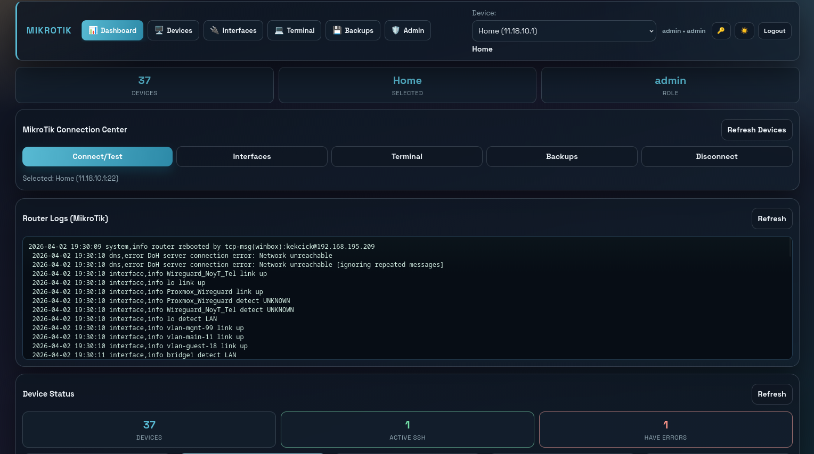

# Mikrotik Console

English and Ukrainian documentation are provided below.

---

## English

Web console for MikroTik fleet operations with role-based access, SSH diagnostics, safe broadcast flow, backups, and audit logs.

### UI Preview



_Current dashboard view: devices, interfaces, terminal, diagnostics, backups, and audit panel._

### Features

- Device inventory and SSH connectivity test
- Interface list and enable/disable actions
- Interface edit menu (MTU, comment, rename)
- Terminal commands on one device
- Safe broadcast workflow (dry-run + confirm token)
- Backup capture, upload, download, restore, delete
- SSH status and diagnostics panel
- User roles: admin, operator, viewer
- Audit log for critical actions
- Edit existing devices from Devices page
- System full backup + restore from browser (admin)

### What Is New In This Release

- Global device selector in navbar
- Toast notifications instead of single-line status
- Terminal command history (`ArrowUp`/`ArrowDown`)
- Device search/filter in Devices page
- Dashboard behavior fixes (no accidental auto-connect from card select)
- Interface table now shows `Port` and `Comment`
- Full system backup/restore actions available in Backups page (admin)
- `Backup All Reachable` for sequential per-device backups

### Requirements

- Docker Engine + Docker Compose plugin
- Linux/macOS shell (or adapt commands for your OS)
- Port 8080 available (for standalone mode)

### Quick Start (No Traefik)

1. Clone repository and enter folder.
2. Create local env file:

```bash
cp .env.example .env
```

3. Generate valid `MIM_SECRET` and place it into `.env`:

```bash
python3 -c 'from cryptography.fernet import Fernet; print(Fernet.generate_key().decode())'
```

Minimal `.env` example:

```env
MIM_SECRET=PASTE_GENERATED_KEY
MIM_PORT=8080
DATA_DIR=/data
MIM_ADMIN_PASSWORD=admin
```

4. Start service:

```bash
mkdir -p data
docker compose -f docker-compose.standalone.yml up -d --build
```

5. Open app:

- URL: `http://localhost:${MIM_PORT}` (default `http://localhost:8080`)
- Health: `http://localhost:${MIM_PORT}/api/health`

6. First login:

- `admin` / `admin`
- `operator` / `operator`

Change passwords immediately after login.

### Quick Start (With Traefik)

Use this mode if you already have Traefik and external network `traefik_net`.

1. In `.env`, set:

- `MIM_SECRET` (valid Fernet key)
- `TRAEFIK_DOMAIN` (for example: `example.com`)

Minimal `.env` for Traefik mode:

```env
MIM_SECRET=PASTE_GENERATED_KEY
TRAEFIK_DOMAIN=example.com
DATA_DIR=/data
MIM_ADMIN_PASSWORD=admin
```

2. Ensure Traefik network exists:

```bash
docker network ls | grep traefik_net
```

3. Start service behind Traefik:

```bash
mkdir -p data
docker compose -f docker-compose.traefik.yml up -d --build
```

4. Open app:

- `https://mikrotik-console.${TRAEFIK_DOMAIN}`

### Included Compose Files

- `docker-compose.standalone.yml` - run directly on host port
- `docker-compose.traefik.yml` - run behind existing Traefik

### Browser Recovery (Full System)

For admin users, open `Backups` page and use `System Backup (Full)`:

- `Create Full Backup`
- `Download`
- `Restore Full`

`Restore Full` replaces the current app DB and backup files from the selected archive.

### Backups Page (Quick Overview)

- `Create Backup` - backup for currently selected device
- `Backup All Reachable` - sequential backups for all devices visible to current user
- `Upload/Download/Restore` - per-device backup file operations
- `System Backup (Full)` (admin) - full app data backup and restore

### Environment Variables

Required:

- `MIM_SECRET` - auth/signing secret, must be a valid Fernet key (url-safe base64)

Common optional:

- `MIM_ADMIN_PASSWORD` (default: `admin`, only used when admin does not exist yet)
- `MIM_PORT` (default: `8080`, standalone mode)
- `DATA_DIR` (default: `/data`)

Optional tuning:

- `MIM_SSH_IDLE_TTL_SECONDS` (default: 120)
- `MIM_SSH_KEEPALIVE_SECONDS` (default: 20)
- `MIM_SSH_CONNECT_TIMEOUT` (default: 10)
- `MIM_SSH_COMMAND_TIMEOUT` (default: 25)
- `MIM_SSH_RETRY_ATTEMPTS` (default: 2)
- `MIM_SSH_RETRY_BASE_MS` (default: 220)
- `MIM_BROADCAST_CONFIRM_TTL_SECONDS` (default: 90)

### Security Notes

- Change default credentials immediately.
- Keep `MIM_SECRET` private and strong.
- Limit access with firewall/VPN.

### Development

```bash
pip install -r requirements.txt
MIM_SECRET="$(python3 -c 'from cryptography.fernet import Fernet; print(Fernet.generate_key().decode())')" \
uvicorn app:app --host 0.0.0.0 --port 8080
```

---

## Українська

Веб-консоль для керування флотом MikroTik з рольовим доступом, SSH-діагностикою, безпечним broadcast, бекапами та журналом дій.

### Скріншот інтерфейсу


_Актуальний вигляд панелі: пристрої, інтерфейси, термінал, діагностика, бекапи та журнал дій._

### Можливості

- Список пристроїв і тест SSH-з'єднання
- Перегляд інтерфейсів і дії enable/disable
- Меню редагування інтерфейсів (MTU, comment, перейменування)
- Виконання команд на одному пристрої
- Безпечний broadcast (dry-run + token підтвердження)
- Створення, завантаження, вивантаження, відновлення та видалення бекапів
- Панель SSH статусу та діагностики
- Ролі користувачів: admin, operator, viewer
- Журнал критичних дій (audit)
- Редагування існуючих девайсів зі сторінки Devices
- Повний системний backup + restore через браузер (admin)

### Що Нового У Цьому Релізі

- Глобальний селектор пристрою в navbar
- Toast-повідомлення замість одного рядка статусу
- Історія команд у Terminal (`ArrowUp`/`ArrowDown`)
- Пошук/фільтр девайсів у Devices
- Виправлена поведінка Dashboard (без випадкового auto-connect по кліку картки)
- У таблиці Interfaces додані `Port` і `Comment`
- Повні системні backup/restore дії у сторінці Backups (admin)
- `Backup All Reachable` для послідовних backup усіх доступних девайсів

### Вимоги

- Docker Engine + плагін Docker Compose
- Linux/macOS shell (або адаптуйте команди під вашу ОС)
- Вільний порт 8080 (для standalone режиму)

### Швидкий запуск (Без Traefik)

1. Клонуйте репозиторій і перейдіть у папку проєкту.
2. Створіть локальний env-файл:

```bash
cp .env.example .env
```

3. Згенеруйте валідний `MIM_SECRET` і вставте його в `.env`:

```bash
python3 -c 'from cryptography.fernet import Fernet; print(Fernet.generate_key().decode())'
```

Мінімальний приклад `.env`:

```env
MIM_SECRET=PASTE_GENERATED_KEY
MIM_PORT=8080
DATA_DIR=/data
MIM_ADMIN_PASSWORD=admin
```

4. Запустіть сервіс:

```bash
mkdir -p data
docker compose -f docker-compose.standalone.yml up -d --build
```

5. Відкрийте застосунок:

- URL: `http://localhost:${MIM_PORT}` (типово `http://localhost:8080`)
- Health: `http://localhost:${MIM_PORT}/api/health`

6. Перший вхід:

- `admin` / `admin`
- `operator` / `operator`

Одразу змініть паролі після входу.

### Швидкий запуск (З Traefik)

Використовуйте цей режим, якщо у вас уже є Traefik і зовнішня мережа `traefik_net`.

1. У `.env` заповніть:

- `MIM_SECRET` (валідний Fernet key)
- `TRAEFIK_DOMAIN` (наприклад: `example.com`)

Мінімальний `.env` для режиму Traefik:

```env
MIM_SECRET=PASTE_GENERATED_KEY
TRAEFIK_DOMAIN=example.com
DATA_DIR=/data
MIM_ADMIN_PASSWORD=admin
```

2. Переконайтеся, що мережа Traefik існує:

```bash
docker network ls | grep traefik_net
```

3. Запустіть сервіс за Traefik:

```bash
mkdir -p data
docker compose -f docker-compose.traefik.yml up -d --build
```

4. Відкрийте застосунок:

- `https://mikrotik-console.${TRAEFIK_DOMAIN}`

### Файли Compose у репозиторії

- `docker-compose.standalone.yml` - запуск напряму на порт хоста
- `docker-compose.traefik.yml` - запуск за існуючим Traefik

### Повне Відновлення Через Браузер

Для admin-користувача у сторінці `Backups` доступний блок `System Backup (Full)`:

- `Create Full Backup`
- `Download`
- `Restore Full`

`Restore Full` замінює поточну БД застосунку та backup-файли з вибраного архіву.

### Сторінка Backups (Коротко)

- `Create Backup` - backup поточного вибраного девайса
- `Backup All Reachable` - послідовний backup усіх девайсів, видимих поточному користувачу
- `Upload/Download/Restore` - операції з backup-файлами девайса
- `System Backup (Full)` (admin) - повний backup і restore даних застосунку

### Змінні середовища

Обов'язково:

- `MIM_SECRET` - секрет авторизації/підпису, валідний Fernet key (url-safe base64)

Часто потрібні:

- `MIM_ADMIN_PASSWORD` (типово: `admin`, застосовується лише якщо admin ще не існує)
- `MIM_PORT` (типово: `8080`, для standalone режиму)
- `DATA_DIR` (типово: `/data`)

Додаткові параметри:

- `MIM_SSH_IDLE_TTL_SECONDS` (типово: 120)
- `MIM_SSH_KEEPALIVE_SECONDS` (типово: 20)
- `MIM_SSH_CONNECT_TIMEOUT` (типово: 10)
- `MIM_SSH_COMMAND_TIMEOUT` (типово: 25)
- `MIM_SSH_RETRY_ATTEMPTS` (типово: 2)
- `MIM_SSH_RETRY_BASE_MS` (типово: 220)
- `MIM_BROADCAST_CONFIRM_TTL_SECONDS` (типово: 90)

### Безпека

- Одразу змініть стандартні паролі.
- Тримайте `MIM_SECRET` приватним і складним.
- Обмежте доступ через firewall/VPN.

### Розробка

```bash
pip install -r requirements.txt
MIM_SECRET="$(python3 -c 'from cryptography.fernet import Fernet; print(Fernet.generate_key().decode())')" \
uvicorn app:app --host 0.0.0.0 --port 8080
```
